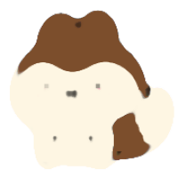

# 10. 画像処理 (1)

第 10 回では、OpenCV を用いた画像処理の基本について学びます。

## 10.1 画像処理とは

画像処理とは、デジタル画像を取り扱う技術の総称であり、以下のような処理が含まれます。

- 画像の読み込み・表示・保存
- 画像の編集（リサイズ、回転・拡大縮小・平行移動、トリミングなど）
- 画像のフィルタリング（ぼかし、鮮鋭化など）
- 画像の二値化、セグメンテーション
- 特徴抽出や解析（エッジ検出、顔認識など）

## 10.2 Python の画像処理ライブラリ

Python には画像処理を行うためのライブラリとして、大きく Pillow と OpenCV が存在します。

### 10.2.1 Pillow

Pillow は、Python Imaging Library (PIL) の後継にあたるライブラリで、シンプルで簡単な画像操作に特化しています。

Pillow: [https://pillow.readthedocs.io/](https://pillow.readthedocs.io/)

Pillow は、以下のコマンドでインストールすることができます。

```
pip install Pillow
```

### 10.2.2 OpenCV

OpenCV (Open Source Computer Vision Library) は、コンピュータビジョンと機械学習のための包括的なオープンソースライブラリであり、幅広い画像・動画の処理機能を持っています。

OpenCV: [https://opencv.org/](https://opencv.org/)

本講義では、基本的なものから発展的なものまで、さまざまな画像処理タスクに対応可能な OpenCV の扱い方を学びます。OpenCV は、以下のコマンドでインストールすることができます。

```
pip install opencv-python
```

!!! note "CHIKUWA Editor における画像処理ライブラリ"

    CHIKUWA Editor には、Pillow と OpenCV をインストール済みであり、インポートしてすぐに使うことができます。ただし、セキュリティの都合上、ライブラリ内の関数による画像の表示や保存はできないようになっています。CHIKUWA Editor で画像処理の結果を表示するには、`Matplotlib.pyplot` を使用します。

## 10.3 OpenCV による画像処理の基本

Python 版の OpenCV による画像処理の基本操作を見ていきましょう。

### 10.3.1 OpenCV のインポート

OpenCV ライブラリをインポートするには、以下のようにします。

```python
import cv2
```

### 10.3.2 画像の読み込み

画像ファイルを読み込むには、[`cv2.imread()`](https://docs.opencv.org/4.11.0/d4/da8/group__imgcodecs.html#gacbaa02cffc4ec2422dfa2e24412a99e2) 関数を用います。

以下のはんぺん君の画像 (`hanpen.png`) を読み込み、`print()` で中身を出力してみましょう。


```python
import cv2

# 画像の読み込み
image = cv2.imread("hanpen.png")

# 画像情報の表示
print("shape:", image.shape)
print("data:", image)
```

```title="Output"
shape: (180, 180, 3)
data: [[[255 255 255]
  [255 255 255]
  [255 255 255]
  ...
  [255 255 255]
  [255 255 255]
  [255 255 255]]

 ...

 [[255 255 255]
  [255 255 255]
  [255 255 255]
  ...
  [255 255 255]
  [255 255 255]
  [255 255 255]]]
```

`image.shape` により、`(180, 180, 3)` という結果が出力されました。これは、画像データの高さが `180`、幅が `180`、チャンネル数が `3` であることを表しています。ここでチャンネル数とは色情報のことで、OpenCV では **BGR 色空間** (Blue, Green, Red) がデフォルトで使用されます。Blue, Green, Red はそれぞれ 0 ～ 255 の数値で表現され、(0, 0, 0) は黒、(255, 255, 255) は白を意味します。

出力された `[255 255 255]` という配列（`ndarray`）は、画像上の 1 ピクセルの色情報を表しており、そのピクセルが白であることを意味します。

### 10.3.3 画像の表示

画像を読み込むことができたので、`matplotlib.pyplot` を用いて表示してみましょう。

画像の表示には、[`pyplot.imshow()`](https://matplotlib.org/stable/api/_as_gen/matplotlib.pyplot.imshow.html) 関数を用います。以下は、画像表示のコード例と工夫点です。

- 元画像の縦横比に合わせて画像サイズを指定しています（`plt.figure(figsize=(2, 2))`）。
- デフォルトで表示されるグラフの軸を非表示にしています（`plt.axis("off")`）。
- デフォルトで設定される余白（パディング）を `0` にしています（`plt.tight_layout(pad=0)`）。

```python
import cv2
import matplotlib.pyplot as plt

# 画像の読み込み
image = cv2.imread("hanpen.png")

# 出力する画像のサイズを指定
plt.figure(figsize=(2, 2))

# 画像を表示
plt.imshow(image)
plt.axis("off")
plt.tight_layout(pad=0)
plt.show()
```


顔色の悪いはんぺん君が表示されてしまいました。これは、OpenCV が **BGR** (Blue, Green, Red) の順で画像を読み込むのに対し、Matplotlib が **RGB** (Red, Green, Blue) の順で画像を表示しているためです。この問題を解決するには、[`cv2.cvtColor()`](https://docs.opencv.org/4.11.0/d8/d01/group__imgproc__color__conversions.html#gaf86c09fe702ed037c03c2bc603ceab14) 関数により、色空間の変換を行います。

BGR 色空間を RGB 色空間に変換するには、`cv2.cvtColor()` の第 2 引数で `cv2.COLOR_BGR2RGB` を指定します。その他の変換コード一覧は [ColorConversionCodes](https://docs.opencv.org/4.11.0/d8/d01/group__imgproc__color__conversions.html#ga4e0972be5de079fed4e3a10e24ef5ef0) で確認することができます。以下は、今回のケースにおけるコード例です。

```python
import cv2
import matplotlib.pyplot as plt

# 画像の読み込み
image = cv2.imread("hanpen.png")

# 出力する画像のサイズを指定
plt.figure(figsize=(2, 2))

# 画像を表示（色の順序を BGR → RGB に変換）
plt.imshow(cv2.cvtColor(image, cv2.COLOR_BGR2RGB))
plt.axis("off")
plt.tight_layout(pad=0)
plt.show()
```


本来の色合いのはんぺん君が表示されるようになりました。

!!! note "色空間を変換するタイミング"

    画像を読み込んですぐに色空間を変換することも可能ですが、OpenCV の関数の多くは画像データが BGR であることを前提としたものとなっているので、基本的には画像表示のタイミングで変換することが望ましいです。ただし、色空間の変換そのものが画像処理の目的である場合は、その限りではありません。

!!! question "なぜ OpenCV では BGR 色空間が使用される？"

    現代のほとんどのシステムでは RGB が標準であるのに対し、OpenCV では BGR が標準となっています。この理由として、主に以下のような歴史的・技術的背景があります。

    - Windows BMP ファイルは BGR で色情報を扱っており、OpenCV の初期開発時（1999年頃）は Windows が主流であった。
    - 開発元の Intel のエコシステム（Windows + 最適化ライブラリ + 当時のハードウェア）において、BGR が効率的であった。

## 10.4 画像の編集（リサイズ、回転・拡大縮小・平行移動、トリミング）

基本的な画像処理の操作として、リサイズ、回転・拡大縮小・平行移動、トリミングの方法を見ていきましょう。

### 10.4.1 画像のリサイズ

画像のサイズを変更するには、[`cv2.resize()`](https://docs.opencv.org/4.11.0/da/d54/group__imgproc__transform.html#ga47a974309e9102f5f08231edc7e7529d) 関数を用います。第 1 引数で画像データを指定し、第 2 引数で `(幅, 高さ)` のタプル形式で画像の幅と高さを指定することができます。`shape` で取得した `ndarray` の配列 `(高さ, 幅, チャンネル数)` とは、「幅」と「高さ」の位置が逆になっている点に注意してください。

```python title="解像度の変更 (180, 180) → (50, 50)"
resized_image = cv2.resize(image, (50, 50))
```


```python title="縦横比の変更 (180, 180) → (180, 80)""
resized_image = cv2.resize(image, (180, 80))
```


### 10.4.2 画像の回転・拡大縮小・平行移動

画像の回転・拡大縮小・平行移動は、すべて **アフィン変換 (affine transformation)** にまとめて表現することができます。アフィン変換は、直線を直線のまま保つ変換のことで、「回転」「平行移動」「拡大・縮小」「せん断」の操作を含みます。

アフィン変換を行うための行列は、[`cv2.getRotationMatrix2D()`](https://docs.opencv.org/4.11.0/da/d54/group__imgproc__transform.html#gafbbc470ce83812914a70abfb604f4326) 関数で作成することができます。第 1 引数には回転中心、第 2 引数には回転角度、第 3 引数には拡大率を指定します。また、作成された行列の `[0, 2]` には `x` 方向の平行移動量、`[1, 2]` には `y` 方向の平行移動量を指定することができます。

アフィン変換行列を用いてアフィン変換を適用するには、[`cv2.warpAffine()`](https://docs.opencv.org/4.11.0/da/d54/group__imgproc__transform.html#ga0203d9ee5fcd28d40dbc4a1ea4451983) 関数を用います。第 1 引数に画像データ、第 2 引数にアフィン変換行列、第 3 引数に出力される画像のサイズを指定します。

以下は、アフィン変換行列を定義し、アフィン変換を適用するコード例です。

```python
import cv2
import matplotlib.pyplot as plt

# 画像の読み込み
image = cv2.imread("hanpen.png")

# 画像のサイズを取得
height, width = image.shape[:2]

# パラメータ設定
center = (width // 2, height // 2)
angle = 45
scale = 2.6
tx, ty = 35, -25

# アフィン変換行列
affine_matrix = cv2.getRotationMatrix2D(center, angle, scale)
affine_matrix[0, 2] += tx   # x方向の移動
affine_matrix[1, 2] += ty   # y方向の移動

# アフィン変換を適用
transformed = cv2.warpAffine(image, affine_matrix, (width, height))

# 出力する画像のサイズを指定
plt.figure(figsize=(2, 2))

# 画像を表示（色の順序を BGR → RGB に変換）
plt.imshow(cv2.cvtColor(transformed, cv2.COLOR_BGR2RGB))
plt.axis("off")
plt.tight_layout(pad=0)
plt.show()
```


### 10.4.3 画像のトリミング

画像のトリミング（クロップ）は、NumPy 配列 (`ndarray`) に対するスライシングによって、行うことができます。例えば、高さ方向について 60 ～ 109 行のピクセル、幅方向について 30 ～ 119 列のピクセル領域を取り出したい場合は、以下のようにします。繰り返しになりますが、`ndarray` では [高さ、幅] の順になっている点に注意してください。

```python
cropped_image = image[60:110, 30:120]
```


## 10.5 基本的なフィルタ処理

フィルタ処理 (Filtering) とは、画像の各ピクセルに対して何らかの操作を行うことで、画像処理（ノイズ除去や特徴抽出）を実現する技術の総称です。本節では、OpenCV による基本的なフィルタ処理の例として、**平滑化フィルタ**を紹介します。

平滑化フィルタは、画像をなめらかにする（ぼかすように）加工することで、画像中のノイズを低減させるためのフィルタです。主な種類としては、以下の 3 つがあります。

- **平均値フィルタ**
- **ガウシアンフィルタ**
- **メディアンフィルタ**

### 10.5.1 平均値フィルタ

平均値フィルタは、周辺画素の平均値を中央の画素に置き換えるシンプルなフィルタです。[`cv2.blur()`](https://docs.opencv.org/4.11.0/d4/d86/group__imgproc__filter.html#ga8c45db9afe636703801b0b2e440fce37) 関数を用いて、第 1 引数に画像データ、第 2 引数にカーネルサイズ（x, y 方向のぼかしの大きさ）を指定することで、適用することができます。以下は、平均値フィルタの実装例です。

```python
import cv2
import matplotlib.pyplot as plt

# 画像の読み込み
image = cv2.imread("hanpen.png")

# 平均値フィルタ
filtered = cv2.blur(image, (15, 15))

# 出力する画像のサイズを指定
plt.figure(figsize=(2, 2))

# 画像を表示
plt.imshow(cv2.cvtColor(filtered, cv2.COLOR_BGR2RGB))
plt.axis("off")
plt.tight_layout(pad=0)
plt.show()
```


### 10.5.2 ガウシアンフィルタ

ガウシアンフィルタは、ガウス分布に基づいた重み付き平均を使用したフィルタであり、平均値フィルタよりも自然な平滑化ができることで知られています。[`cv2.GaussianBlur()`](https://docs.opencv.org/4.11.0/d4/d86/group__imgproc__filter.html#gae8bdcd9154ed5ca3cbc1766d960f45c1) 関数を用いて、第 1 引数に画像データ、第 2 引数にカーネルサイズ、第 3 引数に標準偏差（ガウス分布の広がり具合 ※ `0` にすると自動計算）を指定することで、適用することができます。以下はガウシアンフィルタのコード例です。

```python title="ガウシアンフィルタ"
filtered = cv2.GaussianBlur(image, (15, 15), 0)
```


### 10.5.3 メディアンフィルタ

メディアンフィルタは、周辺画素の中央値を中央の画素に置き換えるフィルタで、ごま塩ノイズに強いことで知られています。[`cv2.medianBlur()`](https://docs.opencv.org/4.11.0/d4/d86/group__imgproc__filter.html#ga564869aa33e58769b4469101aac458f9) 関数を用いて、第 1 引数に画像データ、第 2 引数にカーネルサイズ（正の整数かつ奇数）を指定することで、適用することができます。以下はメディアンフィルタのコード例です。

```python title="メディアンフィルタ"
filtered = cv2.medianBlur(image, 15)
```



!!! warning "フィルタ処理におけるカーネルサイズについて"

    多くのフィルタ処理では、周辺の画素値の情報を用いて、中央の値を置き換える操作を行います。このため、周辺の範囲を指定するカーネル（フィルタ）のサイズは、奇数である必要があります。

## 演習

!!! tip "演習 10-1"

    OpenCV を用いて、画像に対してアフィン変換（回転、拡大・縮小、平行移動）を適用してください。また、画像の一部をトリミングしてください。

!!! tip "演習 10-2"

    OpenCV を用いて、ごま塩ノイズを含む画像に対して、メディアンフィルタを適用してノイズ除去を行ってください。

### 演習用画像

演習用の画像データです。本講義の演習目的でのみ使用するようにしてください。

- オリジナル画像：<br>　[あめ](./img/ame_original.png) / [つむぎ](./img/tsumugi_original.png)
- ガウシアンノイズ：<br>　[あめ](./img/ame_gaussian_noise.png) / [つむぎ](./img/tsumugi_gaussian_noise.png)
- ごま塩ノイズ：<br>　[あめ](./img/ame_gomashio_noise.png) / [つむぎ](./img/tsumugi_gomashio_noise.png)
- ガウシアンノイズ + ごま塩ノイズ：<br>　[あめ](./img/ame_hybrid_noise.png) / [つむぎ](./img/tsumugi_hybrid_noise.png)

### ノイズ付与のコード例

自分で用意した画像でノイズ除去の練習をしたい場合は、以下のコードを参考にノイズの付与を検討してください。

```python title="ガウシアンノイズの付与"
def add_gaussian_noise(img, mu=0, sigma=20):
    """
    ガウシアンノイズを画像に追加する関数

    Parameters:
    img: 入力画像
    mu: ノイズの平均値（デフォルト: 0）
    sigma: ノイズの標準偏差（デフォルト: 20）

    Returns:
    noisy_img: ノイズが追加された画像
    """
    noise = np.random.normal(mu, sigma, img.shape)
    noisy_img = img + noise
    return np.clip(noisy_img, 0, 255).astype(np.uint8)
```

```python title="ごま塩ノイズの付与"
def add_salt_pepper_noise(img, salt_prob=0.01, pepper_prob=0.01):
    """
    ごま塩ノイズを画像に追加する関数

    Parameters:
    img: 入力画像
    salt_prob: 白点ノイズの確率（デフォルト: 0.01）
    pepper_prob: 黒点ノイズの確率（デフォルト: 0.01）

    Returns:
    noisy_img: ノイズが追加された画像
    """
    noisy_img = img.copy()
    h, w = img.shape[:2]

    # 白点ノイズ（Salt）
    salt_coords = np.random.random((h, w)) < salt_prob
    noisy_img[salt_coords] = 255

    # 黒点ノイズ（Pepper）
    pepper_coords = np.random.random((h, w)) < pepper_prob
    noisy_img[pepper_coords] = 0

    return noisy_img
```

## 授業アンケート

<div style="text-align: center;">
<a href="https://forms.office.com/r/RnW4Va0sNd">

</a>
<br>
<a href="https://forms.office.com/r/RnW4Va0sNd">https://forms.office.com/r/RnW4Va0sNd</a><br>
（回答期限：2025 年 6 月 30 日 23:59）
</div>
