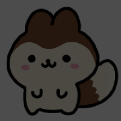
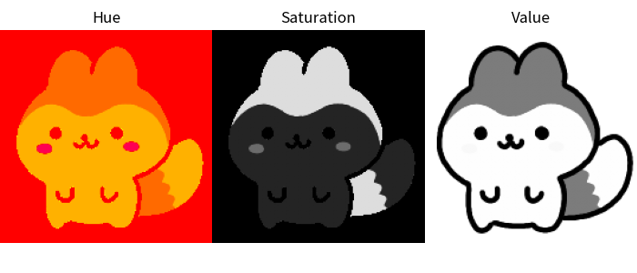

## 10.5 色空間とチャンネル操作

### 10.5.1 グレースケール変換

```python
import cv2
import matplotlib.pyplot as plt

# 画像の読み込み
image = cv2.imread("hanpen.png")

# グレースケール化
gray_image = cv2.cvtColor(image, cv2.COLOR_BGR2GRAY)

# 出力する画像のサイズを指定
plt.figure(figsize=(2, 2))

# 画像を表示
plt.imshow(gray_image, cmap="gray")
plt.axis("off")
plt.tight_layout(pad=0)
plt.show()
```


### 10.5.2 HSV 色空間への変換

```python
import cv2
import matplotlib.pyplot as plt

# 画像の読み込み
image = cv2.imread("hanpen.png")

# HSV 色空間
hsv_image = cv2.cvtColor(image, cv2.COLOR_BGR2HSV)

# 色相をずらす
hsv_image[:, :, 0] = hsv_image[:, :, 0] + 150

# 出力する画像のサイズを指定
plt.figure(figsize=(2, 2))

# 画像を表示
plt.imshow(cv2.cvtColor(hsv_image, cv2.COLOR_HSV2RGB))
plt.axis("off")
plt.tight_layout(pad=0)
plt.show()
```


```python
hsv_image[:, :, 1] = hsv_image[:, :, 1] * 0.3
```


```python
hsv_image[:, :, 2] = hsv_image[:, :, 2] * 0.3
```



```python
import cv2
import matplotlib.pyplot as plt

# 画像の読み込み
image = cv2.imread("hanpen.png")

# HSVへの変換
hsv_image = cv2.cvtColor(image, cv2.COLOR_BGR2HSV)

# HSV画像の表示（個々のチャンネルの可視化）
hue, saturation, value = cv2.split(hsv_image)

# 図とサブプロットの作成
fig, axes = plt.subplots(1, 3, figsize=(7, 3))

# Hue
axes[0].imshow(hue, cmap="hsv")
axes[0].axis("off")
axes[0].set_title("Hue")

# Saturation
axes[1].imshow(saturation, cmap="gray")
axes[1].axis("off")
axes[1].set_title("Saturation")

# Value
axes[2].imshow(value, cmap="gray")
axes[2].axis("off")
axes[2].set_title("Value")

plt.tight_layout(pad=0)
plt.show()
```

{: .wide-image }

```python
# チャンネルの結合
recombined_image = cv2.merge([hue, saturation, value])
```
