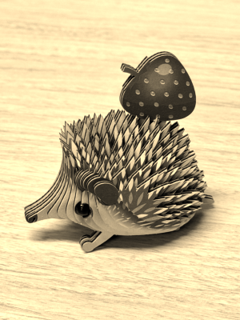

# 11. 画像処理 (2)

第 11 回では前回から引き続き、OpenCV を用いた画像処理の基本について学びます。

## 11.1 さまざまなフィルタ処理

前回、平滑化フィルタとして「平均値フィルタ」「ガウシアンフィルタ」「メディアンフィルタ」を紹介しました。今回は、その他に存在するさまざまなフィルタについて、代表的なものを紹介します。

今回、以下のはりねずみのクラフトの写真（[hedgehog.png](img/hedgehog.png)）に対して画像処理を適用していきます。


### 11.1.1 鮮鋭化フィルタ

平滑化フィルタと逆の効果を持つフィルタとして、**鮮鋭化フィルタ** があります。鮮鋭化フィルタは、画像のエッジを強調することができます。

OpenCV には鮮鋭化専用の関数は用意されていませんが、一般的なフィルタ処理を行うための [`cv2.filter2D()`](https://docs.opencv.org/4.11.0/d4/d86/group__imgproc__filter.html#ga27c049795ce870216ddfb366086b5a04) 関数を使って鮮鋭化を行うことができます。鮮鋭化カーネルとしては、以下のコード例に示したものがよく使用されます。

```python
import cv2
import numpy as np
import matplotlib.pyplot as plt

# 画像の読み込み
image = cv2.imread("hedgehog.png")

# 鮮鋭化フィルタ（カーネル）
kernel = np.array([[0, -1, 0],
                   [-1, 5, -1],
                   [0, -1, 0]])
filtered = cv2.filter2D(image, -1, kernel)

# 出力する画像のサイズを指定
plt.figure(figsize=(3, 4))

# 画像を表示
plt.imshow(cv2.cvtColor(filtered, cv2.COLOR_BGR2RGB))
plt.axis("off")
plt.tight_layout(pad=0)
plt.show()
```


エッジが強調された画像になりました。しかし、ややざらざらした感じの画像にもなっています。

!!! note "`filter2D()` 関数について"

    [`filter2D()`](https://docs.opencv.org/4.11.0/d4/d86/group__imgproc__filter.html#ga27c049795ce870216ddfb366086b5a04) 関数を使うことで、独自に定義したさまざまなカーネル（フィルタ）を簡単に適用することができます。例えば、前回の講義で扱った平滑化フィルタ処理も、[`filter2D()`](https://docs.opencv.org/4.11.0/d4/d86/group__imgproc__filter.html#ga27c049795ce870216ddfb366086b5a04) 関数に置き換えることができます。

#### アンシャープマスク

より自然な鮮鋭化を行う手段として、アンシャープマスク (unsharp masking) もよく使用されます。アンシャープマスクは、一度画像を平滑化し（ぼかし）、元画像から差し引くことで、エッジを強調するというものです。

画像の平滑化には一般に [`cv2.GaussianBlur()`](https://docs.opencv.org/4.11.0/d4/d86/group__imgproc__filter.html#gae8bdcd9154ed5ca3cbc1766d960f45c1) 関数が用いられ、画像の引き算には [`cv2.addWeighted()`](https://docs.opencv.org/4.11.0/d2/de8/group__core__array.html#gafafb2513349db3bcff51f54ee5592a19) 関数が用いられます。以下は、ガウスアンフィルタで滑らかな画像を作成し、元画像から差し引くことでアンシャープマスクを実装するコード例です。ここで、元画像とぼかし画像の強度比は `2:1` にしています。

```python
# 鮮鋭化フィルタ（アンシャープマスク）
blurred = cv2.GaussianBlur(image, (9, 9), 0)
filtered = cv2.addWeighted(image, 2.0, blurred, -1.0, 0)
```


より自然な形でエッジが強調されました。

### 11.1.2 バイラテラルフィルタ

バイラテラルフィルタ (bilateral filter) は、エッジを保ちつつ画像全体を平滑化することができる、特殊なフィルタです。バイラテラルフィルタは [`cv2.bilateralFilter()`](https://docs.opencv.org/4.11.0/d4/d86/group__imgproc__filter.html#ga9d7064d478c95d60003cf839430737ed) 関数で適用することができ、以下のように使用します。

```python
filtered = cv2.bilateralFilter(image, 15, 100, 100)
```

ここで、第 2 引数はフィルタサイズ（`d`: 半径）、第 3 引数は色の差の許容範囲（`sigmaColor`: 大きいほど滑らか）、第 4 引数は距離の許容範囲（`sigmaSpace`: 大きいほど遠くのピクセルに影響）を意味します。


美肌な感じのはりねずみになりました。

### 11.1.3 エッジ検出フィルタ

フィルタにはエッジを検出する機能を持つものもあります。その中でも特に強力で、さまざまな分野で最も広く使われるエッジ検出アルゴリズムとして、Canny エッジ検出 (Canny edge detection) があります。Canny エッジは以下のように、[`cv2.Canny()`](https://docs.opencv.org/4.11.0/dd/d1a/group__imgproc__feature.html#ga2a671611e104c093843d7b7fc46d24af) 関数で検出することができます。

```python
filtered = cv2.Canny(image, 150, 350)
```

ここで、第 2 引数は弱いエッジの下限（`threshold1`）、第 3 引数は強いエッジの上限（`threshold2`）を意味し、検出されるエッジの範囲を調整することができます。


はりねずみのエッジが検出されました。前処理として平滑化フィルタを適用すると、より精度の良いエッジ検出も可能となります。

また、`ndarray` の操作によって、エッジの情報を用いて画像に効果（ネオン効果）をつけることもできます。以下は、エッジが 0 でない座標のピクセルを、緑 (`[0, 255, 0]`) に置き換えるコード例です。

```python
edges = cv2.Canny(image, 150, 350)
filtered = image.copy()
filtered[edges > 0] = [0, 255, 0]
```


元画像上のどこがエッジとして検出されたか、わかりやすくなりました。

## 11.2 色空間とチャンネル操作

色空間とチャンネルの操作方法について見ていきましょう。

### 11.2.1 グレースケール変換

前回も触れたとおり、OpenCV ではデフォルトで BGR (Blue, Green, Red) 色空間で画像を読み込みます。このそれぞれの色成分のことを**チャンネル**と呼び、BGR 色空間は 3 チャンネルであると言えます。

ここでは、BGR 色空間をグレースケールに変換することを考えてみましょう。[`cv2.cvtColor()`](https://docs.opencv.org/4.11.0/d8/d01/group__imgproc__color__conversions.html#gaf86c09fe702ed037c03c2bc603ceab14) 関数を用いて、第 2 引数に `cv2.COLOR_BGR2GRAY` を指定することで、グレースケール変換を実現できます。チャンネルは 3 から 1 になります。ただし、正しく表示するためには、[`pyplot.imshow()`](https://matplotlib.org/stable/api/_as_gen/matplotlib.pyplot.imshow.html) 関数でカラーマップをグレースケールにする（`cmap="gray"`）必要があることに注意してください。以下はコード例です。

```python
import cv2
import matplotlib.pyplot as plt

# 画像の読み込み
image = cv2.imread("hedgehog.png")

# グレースケール化
gray_image = cv2.cvtColor(image, cv2.COLOR_BGR2GRAY)

# 出力する画像のサイズを指定
plt.figure(figsize=(3, 4))

# 画像を表示
plt.imshow(gray_image, cmap="gray")
plt.axis("off")
plt.tight_layout(pad=0)
plt.show()
```


### 11.2.2 二値化処理

グレースケール変換の結果を用いて、簡易的な二値化処理（しきい値処理）を実装してみましょう。二値化処理とは、ある数値が「しきい値」よりも大きいか小さいかによって、値を二値（白か黒）に分ける処理のことです。エッジ検出の項でやったように、`ndarray` に対する操作で以下のように実装することができます。

```python
import cv2
import matplotlib.pyplot as plt

# 画像の読み込み
image = cv2.imread("hedgehog.png")

# グレースケール化
gray_image = cv2.cvtColor(image, cv2.COLOR_BGR2GRAY)

# しきい値処理
threshold = 100
binary_image = gray_image.copy()
binary_image[gray_image > threshold] = 255
binary_image[gray_image <= threshold] = 0

# 出力する画像のサイズを指定
plt.figure(figsize=(3, 4))

# 画像を表示
plt.imshow(binary_image, cmap="gray")
plt.axis("off")
plt.tight_layout(pad=0)
plt.show()
```


完全な白黒画像になりました。

!!! note "OpenCV における二値化処理について"

    OpenCV では、二値化を行うための関数として [`cv2.threshold()`](https://docs.opencv.org/4.x/d7/d1b/group__imgproc__misc.html#gae8a4a146d1ca78c626a53577199e9c57) や [`cv2.adaptiveThreshold()`](https://docs.opencv.org/4.x/d7/d1b/group__imgproc__misc.html#ga72b913f352e4a1b1b397736707afcde3) が用意されており、簡単に高度な二値化処理を実現することができるようになっています。

### 11.2.3 カラーチャンネルの分割と結合

カラーチャンネルを分割して 1 つずつ扱いたい場合は、[`cv2.split()`](https://docs.opencv.org/4.x/d2/de8/group__core__array.html#ga0547c7fed86152d7e9d0096029c8518a) 関数を用います。また、最終的に結合して表示したい場合には、[`cv2.merge()`](https://docs.opencv.org/4.x/d2/de8/group__core__array.html#ga7d7b4d6c6ee504b30a20b1680029c7b4) 関数を用います。

さらに、各チャンネルに対して数値の加算や減算、乗算、除算を行いたい場合は、それぞれ以下の関数を使うことができます（第 1 引数でチャンネルの `ndarray`、第 2 引数で計算量を指定）。

- 加算: [`cv2.add()`](https://docs.opencv.org/4.x/d2/de8/group__core__array.html#ga10ac1bfb180e2cfda1701d06c24fdbd6)
- 減算: [`cv2.subtract()`](https://docs.opencv.org/4.x/d2/de8/group__core__array.html#gaa0f00d98b4b5edeaeb7b8333b2de353b)
- 乗算: [`cv2.multiply()`](https://docs.opencv.org/4.x/d2/de8/group__core__array.html#ga979d898a58d7f61c53003e162e7ad89f)
- 除算: [`cv2.divide()`](https://docs.opencv.org/4.x/d2/de8/group__core__array.html#ga6db555d30115642fedae0cda05604874)

以下は、赤のチャンネルを強調するコード例です。

```python
import cv2
import matplotlib.pyplot as plt

# 画像の読み込み
image = cv2.imread("hedgehog.png")

# Blue, Green, Red のチャンネルに分割
b, g, r = cv2.split(image)

# Red を強調
r = cv2.add(r, 50)

# Red, Green, Blue の順でチャンネルを結合
recombined_image = cv2.merge([r, g, b])

# 出力する画像のサイズを指定
plt.figure(figsize=(3, 4))

# 画像を表示
plt.imshow(recombined_image)
plt.axis("off")
plt.tight_layout(pad=0)
plt.show()
```


暖色系の色味になりました。青を強調すると、寒色系になります。

以下は、赤と緑のチャンネルを無効化するコード例です。

```python
# Red, Blue を無効化
r[:] = 0
b[:] = 0
```


緑がきつい画像になりました。

### 11.2.4 HSV 色空間への変換

画像処理でよく使用される色空間として、HSV 色空間も押さえておきましょう。HSV はそれぞれ Hue (色相)、Saturation (彩度)、Value (明度) を意味し、これらの数値で RGB と同様にあらゆる色を表現することができるようになっています。


（出典：[Wikimedia Commons](https://commons.wikimedia.org/wiki/File:HSV_color_solid_cylinder.png)）

なお、OpenCV において、色相は 0 ～ 179、彩度は 0 ～ 255、明度は 0 ～ 255 の範囲で表現されます。色相だけ値の範囲が異なっていること、最大値と最小値が環状に繋がっているため、正確に取り扱うには注意が必要となります。以下は、[`cv2.cvtColor()`](https://docs.opencv.org/4.11.0/d8/d01/group__imgproc__color__conversions.html#gaf86c09fe702ed037c03c2bc603ceab14) 関数で `cv2.COLOR_BGR2HSV` を指定して HSV 色空間に変換し、色相・彩度・明度の調整を行うコード例です。

```python
import cv2
import numpy as np
import matplotlib.pyplot as plt

# 画像の読み込み
image = cv2.imread("hedgehog.png")

# HSV 色空間への変換
hsv_image = cv2.cvtColor(image, cv2.COLOR_BGR2HSV)

# チャンネルの分割
h, s, v = cv2.split(hsv_image)

# 色相の回転
h = h.astype(np.int32) # オーバーフロー対策
h = (h + 130) % 180
h = h.astype(np.uint8)

# 彩度の調整
s = cv2.multiply(s, 3)

# 明度の調整
v = cv2.subtract(v, 50)

# チャンネルの結合
recombined_image = cv2.merge([h, s, v])

# 出力する画像のサイズを指定
plt.figure(figsize=(3, 4))

# 画像を表示
plt.imshow(cv2.cvtColor(recombined_image, cv2.COLOR_HSV2RGB))
plt.axis("off")
plt.tight_layout(pad=0)
plt.show()
```


毒々しい雰囲気の画像になりました。

## 11.3 スマホ風フィルタ

最後に、これまでの考え方を応用し、スマートフォンやインスタグラムなどで使用されるフィルタを再現してみましょう。

### 11.3.1 セピア調フィルタ

Blue, Green, Red の各チャンネルに対し、相互に適切な重みを乗じることで、セピア調になることが知られています。以下は、セピア調フィルタの実装例です。[`cv2.filter2D()`](https://docs.opencv.org/4.11.0/d4/d86/group__imgproc__filter.html#ga27c049795ce870216ddfb366086b5a04) 関数や、チャンネルの分割・処理・結合といった流れを適用することもできますが、以下のように [`cv2.transform()`](https://docs.opencv.org/4.11.0/d2/de8/group__core__array.html#ga393164aa54bb9169ce0a8cc44e08ff22) 関数を用いることで簡潔に記述することができます。

```python
import cv2
import numpy as np
import matplotlib.pyplot as plt

# 画像の読み込み
image = cv2.imread("hedgehog.png")

# セピア調フィルタ
sepia_kernel = np.array([[0.272, 0.534, 0.131],
                        [0.349, 0.686, 0.168],
                        [0.393, 0.769, 0.189]])
sepia_image = cv2.transform(image, sepia_kernel)

# 出力する画像のサイズを指定
plt.figure(figsize=(3, 4))

# 画像を表示
plt.imshow(cv2.cvtColor(sepia_image, cv2.COLOR_BGR2RGB))
plt.axis("off")
plt.tight_layout(pad=0)
plt.show()
```



セピア調になりました。

### 11.3.2 レトロ風フィルタ

レトロ風（ヴィンテージ風）の加工フィルタを考えてみましょう。レトロな雰囲気にするためには、HSV 色空間における明度と彩度を調整します。明度を落とすことで、古い雰囲気を表現することができます。また、彩度を上げることで、古いフィルム風（レトロポップ感）を表現することができます。逆に彩度を下げることでも、違った雰囲気のレトロ感やヴィンテージ感を表現することができます。

以下は、明度を下げ、彩度を上げるコード例です。

```python
import cv2
import matplotlib.pyplot as plt

# 画像の読み込み
image = cv2.imread("hedgehog.png")

# レトロ風フィルタ（明度を下げて彩度を上げる）
hsv = cv2.cvtColor(image, cv2.COLOR_BGR2HSV)
h, s, v = cv2.split(hsv)
v = cv2.subtract(v, 30)
s = cv2.add(s, 80)
retro_image = cv2.merge([h, s, v])

# 出力する画像のサイズを指定
plt.figure(figsize=(3, 4))

# 画像を表示
plt.imshow(cv2.cvtColor(retro_image, cv2.COLOR_HSV2RGB))
plt.axis("off")
plt.tight_layout(pad=0)
plt.show()
```


レトロポップな感じになりました。

### 11.3.3 美肌フィルタ

美肌フィルタ（輪郭を保ちつつ全体を滑らかにするフィルタ）も再現してみましょう。実はバイラテラルフィルタだけでも、美肌フィルタを再現することができます。しかし、平滑化と鮮鋭化（アンシャープマスク）を組み合わせることで、より自然な表現を実現することができます。以下は、ガウシアンフィルタ、アンシャープマスク、バイラテラルフィルタを順番に適用して美肌フィルタを実現するコード例です。

```python
import cv2
import matplotlib.pyplot as plt

# 画像の読み込み
image = cv2.imread("hedgehog.png")

# 美肌フィルタ
# 1. 全体を平滑化（ガウシアンフィルタ）
blur = cv2.GaussianBlur(image, (15, 15), 0)

# 2. 滑らかさを保持しながらエッジを強調（アンシャープマスク）
filtered = cv2.addWeighted(image, 1.5, blur, -0.5, 0)

# 3. エッジを保持しながら全体を滑らかに（バイラテラルフィルタ）
filtered = cv2.bilateralFilter(filtered, 15, 80, 80)

# 出力する画像のサイズを指定
plt.figure(figsize=(3, 4))

# 画像を表示
plt.imshow(cv2.cvtColor(filtered, cv2.COLOR_BGR2RGB))
plt.axis("off")
plt.tight_layout(pad=0)
plt.show()
```


美肌風のはりねずみになりました。

### 11.3.4 画像の合成

これまで [`cv2.addWeighted()`](https://docs.opencv.org/4.11.0/d2/de8/group__core__array.html#gafafb2513349db3bcff51f54ee5592a19) 関数をアンシャープマスクに使用してきましたが、この関数は複数画像の合成にも使用することができます。例えば `image` と `image2` を同じ重みで合成するには、以下のようにします。

```python
combined = cv2.addWeighted(image, 0.5, image2, 0.5, 0)
```


はりねずみとペンギン（あめ君）が合成されました。

## 演習

!!! tip "演習 11-1"

    画像に対して、HSV色空間で色相を反転（OpenCVでは90を加算）させてください。また、彩度を下げ、明度を上げる処理を行ってください。

!!! tip "演習 11-2"

    色のチャンネル操作とフィルタ処理を組み合わせて、「秋の季節感（暖色系を強調など）」を演出する画像処理を行ってください。

??? example "チャレンジ課題のヒント（二次元フーリエ変換）"

    信号を周波数の成分に分解するフーリエ変換は、画像に対しても適用することができます。画像の各ピクセルの明度（または特定のカラーチャンネル）を二次元の信号とみなし、二次元フーリエ変換を適用することで、空間領域の画像を周波数領域に変換することができます。

    以下は、画像をグレースケール化し、`numpy.fft.fft2()`関数で二次元フーリエ変換を行うコード例です。視覚的にわかりやすくなるよう、`numpy.fft.fftshift()`関数で低周波数成分を画像の中央に移動させています。さらに、`numpy.abs()`関数でフーリエ変換結果の振幅を求め、`numpy.log10()`関数でその振幅をデシベル（[dB]）に変換することで、対数パワースペクトルを計算しています。

    ```python
    import cv2
    import numpy as np
    import matplotlib.pyplot as plt

    # 画像の読み込み
    image = cv2.imread("ame_original.png")

    # グレースケール変換 (BGR → GRAY)
    gray = cv2.cvtColor(image, cv2.COLOR_BGR2GRAY)

    # 2Dフーリエ変換
    fft = np.fft.fft2(gray)
    fft_shift = np.fft.fftshift(fft)

    # 対数パワースペクトル
    lps = 20 * np.log10(np.abs(fft_shift) + 1e-8)

    # 元画像とフーリエ変換結果を並べて表示
    fig, axs = plt.subplots(1, 2, figsize=(9, 5))

    axs[0].imshow(gray, cmap="gray")
    axs[0].set_title("Original")
    axs[0].axis("off")

    im = axs[1].imshow(lps, cmap="gray")
    axs[1].set_title("2D FFT")
    axs[1].axis("off")

    plt.colorbar(im, ax=axs[1])
    plt.tight_layout()
    plt.show()
    ```

    {: .wide-image }

    二次元フーリエ変換を行った画像では、中央が**低周波成分（ゆるやかな変化）**、外側が**高周波成分（細かい変化）**を表しています。このスペクトル画像から、元画像がどのような特徴を持っているか、また元画像にフィルタをかけるとスペクトルはどのように変化するか、考えてみましょう。

## 授業アンケート

<div style="text-align: center;">
<a href="https://forms.office.com/r/vKGSY3drzc">

</a>
<br>
<a href="https://forms.office.com/r/vKGSY3drzc">https://forms.office.com/r/vKGSY3drzc</a><br>
（回答期限：2025 年 6 月 30 日 23:59）
</div>
