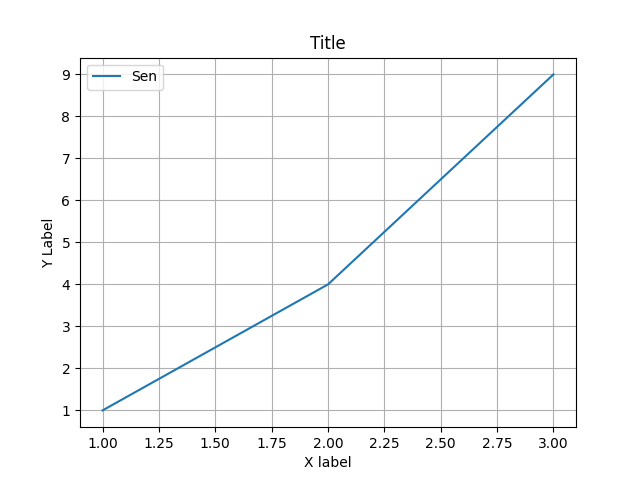
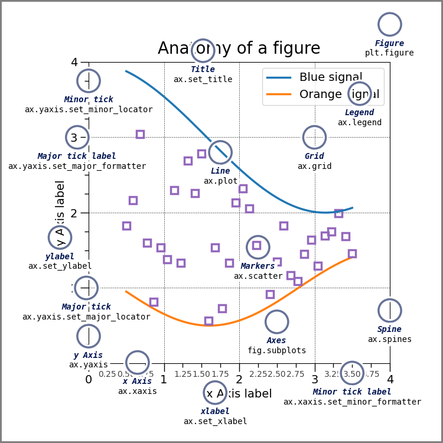
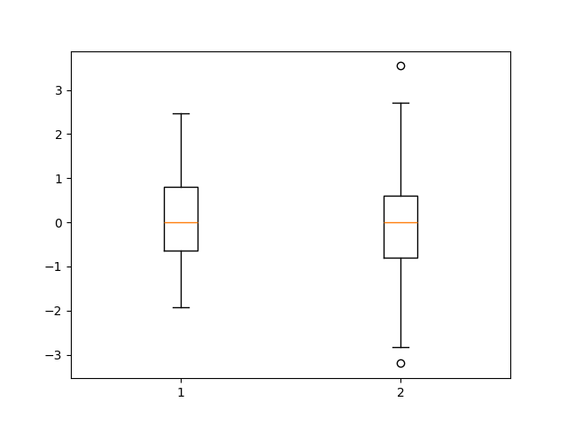
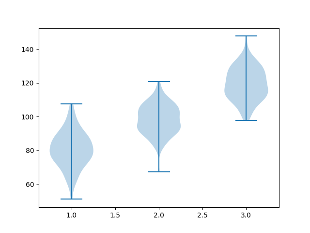
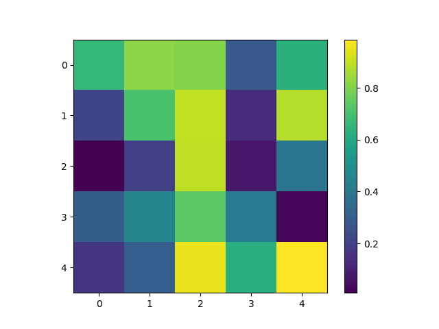
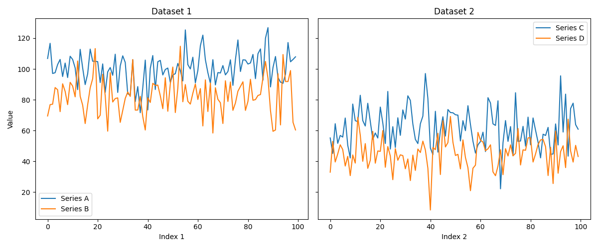
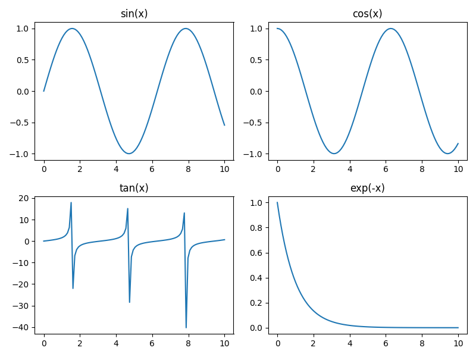

# 3. データ可視化 (2)

第 3 回では [Matplotlib](https://matplotlib.org/) による高度なデータ可視化と、[Seaborn](https://seaborn.pydata.org/) によるリッチなデータ可視化を紹介します。

## 3.1 Matplotlib で高度なグラフを扱う準備

第 2 回では、`Matplotlib.pyplot`を`plt`としてインポートし、`plt.plot()`のようにしてグラフの描画を行いました。シンプルなグラフの描画であればこれでも十分ですが、複数のグラフ描画や細かい制御を行いたい場合は、`fig, ax`スタイルがよく用いられます。

### 3.1.1 `fig, ax` スタイルによるグラフ描画

公式サイトのドキュメントを含む多くのサンプルコードでは、以下のような `fig, ax` を用いた記述が使われています。

```python
import matplotlib.pyplot as plt

# グラフ描画の準備
fig, ax = plt.subplots()

# グラフの描画
ax.plot([1, 2, 3], [1, 4, 9], label="Sen")
ax.set_title("Title")
ax.set_xlabel("X label")
ax.set_ylabel("Y Label")
ax.legend()
ax.grid(True)
plt.show()
```



前回の方法との違いをまとめると、以下のようになります。

| 要素 / 機能 |      plt スタイル       |      fig, ax スタイル      |
| :---------: | :---------------------: | :------------------------: |
| 描画の準備  |            -            | `fig, ax = plt.subplots()` |
|  タイトル   |  `plt.title("Title")`   |  `ax.set_title("Title")`   |
| X 軸ラベル  | `plt.xlabel("X label")` | `ax.set_xlabel("X label")` |
| Y 軸ラベル  | `plt.ylabel("Y label")` | `ax.set_ylabel("Y label")` |
|    凡例     |     `plt.legend()`      |       `ax.legend()`        |
| グリッド線  |    `plt.grid(True)`     |      `ax.grid(True)`       |
| グラフ表示  |      `plt.show()`       |        `plt.show()`        |

描画の準備のコードが追加されたことと、グラフ要素を表示する関数名に一部変化はありますが、基本的には `plt` が `ax` になったくらいで、大きな変化はありません。[`pyplot.subplots()`](https://matplotlib.org/stable/api/_as_gen/matplotlib.pyplot.subplots.html) は複数のグラフ描画や柔軟なレイアウトを実現するためにするもので、上の例のように引数を省略すると単一のグラフが描かれることになります。

### 3.1.2 グラフのカスタマイズ

これまでに「タイトル」や「軸ラベル」「凡例」など、簡単なグラフ要素を紹介してきましたが、Matplotlib ではその他にもさまざまな要素を設定することができます。以下は、[公式サイト](https://matplotlib.org/stable/gallery/showcase/anatomy.html#sphx-glr-gallery-showcase-anatomy-py) で提供されている、グラフ要素一覧を確認できるチートシートです。

<figure markdown="span">
   <figcaption>(Source: matplotlib.org)</figcaption>
</figure>

さらに包括的なチートシートは、以下のリンクから確認することができます。このような情報を適宜参照しながら、洗練されたグラフを描くことを心がけるようにしてください。

Matplotlib cheatsheets and handouts：[https://matplotlib.org/cheatsheets/](https://matplotlib.org/cheatsheets/)

## 3.2 Matplotlib による高度なグラフ描画

前回の「[基本的なグラフの描画](2.md/#23)」では、折れ線グラフや棒グラフなど、基本的なグラフの描き方を紹介しました。ここでは、より高度なグラフについても紹介していきます。

### 3.2.1 グラフ描画関数の一覧

Matplotlib によるグラフ描画関数のうち、特に重要なものの一覧を以下に記します。公式の [Plot types](https://matplotlib.org/stable/plot_types/index.html) や [Examples](https://matplotlib.org/stable/gallery/index.html) にも同等の情報が掲載されていますので、必要に応じて参照するようにしてください。

|     グラフの種類     |    plt スタイル    | fig, ax スタイル  |
| :------------------: | :----------------: | :---------------: |
|     折れ線グラフ     |    `plt.plot()`    |    `ax.plot()`    |
|       棒グラフ       |    `plt.bar()`     |    `ax.bar()`     |
|        散布図        |  `plt.scatter()`   |  `ax.scatter()`   |
|       円グラフ       |    `plt.pie()`     |    `ax.pie()`     |
|     ヒストグラム     |    `plt.hist()`    |    `ax.hist()`    |
|       箱ひげ図       |  `plt.boxplot()`   |  `ax.boxplot()`   |
| エラーバー付きグラフ |  `plt.errorbar()`  |  `ax.errorbar()`  |
|  バイオリンプロット  | `plt.violinplot()` | `ax.violinplot()` |
|     ヒートマップ     |   `plt.imshow()`   |   `ax.imshow()`   |

### 3.2.2 箱ひげ図

箱ひげ図を描くには、[`boxplot()`](https://matplotlib.org/stable/plot_types/stats/boxplot_plot.html) 関数を用います。以下は、標準正規分布に従う分布データを 2 つ生成し、箱ひげ図を描画するコード例です。

```python
import matplotlib.pyplot as plt
import numpy as np

# 標準正規分布に従う分布データを生成
data = [
    np.random.randn(100),
    np.random.randn(100)
]

# 箱ひげ図の描画
fig, ax = plt.subplots()
ax.boxplot(data)
plt.show()
```



### 3.2.3 エラーバー付きグラフ

エラーバー付きグラフを描くには、[`errorbar()`](https://matplotlib.org/stable/plot_types/stats/errorbar_plot.html) 関数を用います。以下は、エラーバー付きグラフの描画例です。

```python
import matplotlib.pyplot as plt

# データの準備

x = [1, 2, 3]
y = [2, 4, 3]
yerr = [0.2, 0.5, 0.3]

# エラーバー付きグラフの描画
fig, ax = plt.subplots()
ax.errorbar(x, y, yerr, fmt="-o")
plt.show()
```


### 3.2.4 バイオリンプロット

バイオリンプロットを描くには、[`violinplot()`](https://matplotlib.org/stable/plot_types/stats/violin.html) 関数を用います。以下は、[`numpy.random.normal(平均値, 標準偏差, サンプル数)`](https://numpy.org/doc/2.1/reference/random/generated/numpy.random.normal.html) 関数を用いて 3 つの分布データを生成し、それを描画するコード例です。

```python
import matplotlib.pyplot as plt
import numpy as np

# 平均値が異なる 3 つの分布データを生成
data = [
    np.random.normal(80, 10, 100),
    np.random.normal(100, 10, 100),
    np.random.normal(120, 10, 100)
]

# バイオリンプロットの描画
fig, ax = plt.subplots()
ax.violinplot(data)
plt.show()
```



### 3.2.5 ヒートマップ

ヒートマップを描くには、[`imshow()`](https://matplotlib.org/stable/plot_types/arrays/imshow.html#sphx-glr-plot-types-arrays-imshow-py) 関数を用います。`ax.imshow()` と書くだけでも描くことができますが、以下のように `colorbar()` 関数を使用してカラーバーを同時に描画することを推奨します。

```python
import matplotlib.pyplot as plt
import numpy as np

# 5x5 の 2 次元データを作成
matrix = np.random.rand(5, 5)

# ヒートマップの描画
fig, ax = plt.subplots()
cax = ax.imshow(matrix)

# カラーバーの描画
fig.colorbar(cax)
plt.show()
```



デフォルトのカラーマップ（配色テーマ）は `viridis`と呼ばれるものになっていますが、`imshow()` の引数で `cmap` を指定することで（例：`ax.imshow(data, cmap="gray")`）、さまざまな色合いに変更することができます。以下は代表的なカラーマップの例です。

- `viridis`：デフォルト。視認性が高く、色覚異常を持つ人々にも見やすい。
- `plasma`：色鮮やかで、印象的かつ色覚異常を持つ人々にも見やすい。
- `inferno`：高コントラストで暗い背景に合う。
- `cividis`：色覚多様性に完全対応。
- `gray`：最も基本的なグレースケール。

### 3.2.6 複数グラフの描画

[`pyplot.subplot()`](https://matplotlib.org/stable/api/_as_gen/matplotlib.pyplot.subplots.html) 関数を使うと、簡単に複数のグラフを描画することができます。第 1 引数で行の数、第 2 引数で列の数を指定することができ、1×2 のグラフを描きたい場合は `subplot(1, 2)` のようにします。以下は、1×2 の折れ線グラフを描画する例です。`subplot()` の引数で、`figsize=(12, 5)`とすることでグラフ全体の幅と高さを 12 インチ ×5 インチに指定し、`sharey=True` とすることで Y 軸を 2 つのグラフで共有する設定としています。

```python
import matplotlib.pyplot as plt
import numpy as np

# データの生成
x = np.arange(100)
y1 = np.random.normal(100, 10, 100)
y2 = np.random.normal(80, 15, 100)
y3 = np.random.normal(60, 12, 100)
y4 = np.random.normal(45, 10, 100)

# 1x2 のプロット + Y 軸共有
fig, axs = plt.subplots(
    1, 2,
    figsize=(12, 5),
    sharey=True
)

# 左の折れ線グラフ
axs[0].plot(x, y1, label="Series A")
axs[0].plot(x, y2, label="Series B")
axs[0].set_title("Dataset 1")
axs[0].set_xlabel("Index 1")
axs[0].set_ylabel("Value")
axs[0].legend()

# 右の折れ線グラフ
axs[1].plot(x, y3, label="Series C")
axs[1].plot(x, y4, label="Series D")
axs[1].set_title("Dataset 2")
axs[1].set_xlabel("Index 2")
axs[1].legend()

# レイアウト調整 &amp; 表示
plt.tight_layout()
plt.show()
```

{: .wide-image }

以下は、2×2 のグラフを描画する例です。

```python
import matplotlib.pyplot as plt
import numpy as np

x = np.linspace(0, 10, 100)

fig, axs = plt.subplots(2, 2, figsize=(8, 6))

axs[0, 0].plot(x, np.sin(x))
axs[0, 0].set_title("sin(x)")

axs[0, 1].plot(x, np.cos(x))
axs[0, 1].set_title("cos(x)")

axs[1, 0].plot(x, np.tan(x))
axs[1, 0].set_title("tan(x)")

axs[1, 1].plot(x, np.exp(-x))
axs[1, 1].set_title("exp(-x)")

plt.tight_layout()
plt.show()
```

{: .wide-image }

!!! question "不自然な形のグラフ"

    tan(x) のグラフが少しおかしな形になってしまっています。値が急激に変化しても不自然にならないよう、`ax.set_ylim(bottom, top)`を使って見た目を整えてみましょう。

## 3.3 Seaborn によるグラフ描画

Seaborn は、Matplotlib をベースとした Python のデータ可視化ライブラリです。Seaborn を使うことで、見やすく美しいグラフをさらに簡単に作ることができます。以下では簡単な使用例のみを紹介しますので、必要に応じて公式のドキュメントを参考にするようにしてください。

Seaborn: [https://seaborn.pydata.org/](https://seaborn.pydata.org/)

### 3.3.1 Seaborn のインポート

Seaborn のインポートは以下のようにして行います。

```python
import seaborn as sns
```

!!! info "Seaborn 利用時の注意"

    Seaborn は Matplotlib 上に構築されているため、グラフの表示やグラフ要素の細かいカスタマイズを行うためには `matplotlib.pyplot`も併せてインポートする必要があります。

### 3.3.2 サンプルデータセット

Seaborn には、データ分析や可視化の練習に便利なサンプルデータセットが用意されています。以下は、有名なサンプルデータセットの一覧です。

| データセット名 |                        概要                        |
| :------------: | :------------------------------------------------: |
|     `tips`     |           レストランのチップに関する情報           |
|     `iris`     |         アヤメの品種と花の長さ・幅のデータ         |
|   `titanic`    |              タイタニック号の乗客情報              |
|   `flights`    |               年・月ごとの航空旅客数               |
|   `diamonds`   |    ダイヤモンドの価格・カット・カラーなどの特徴    |
|   `penguins`   | ペンギンの種類・体重・くちばしのサイズなどのデータ |
|   `planets`    |  発見された惑星に関する情報（質量・年・方法など）  |

その他、利用可能なデータセットの一覧は、以下のようにして取得することができます。

```python
print(sns.get_dataset_names())
```

ここでは、`penguins` データセットを例に、データ可視化の基本的な流れを確認していきましょう。

#### サンプルデータセットの読み込み

サンプルデータセットを読み込むには、[`seaborn.load_dataset()`](https://seaborn.pydata.org/generated/seaborn.load_dataset.html) 関数を用います。引数にデータセット名の文字列を渡すことで、各種データフレームを受け取ることができます。データフレームについては別の回で改めて説明しますが、ここでは表形式のデータ型というくらいの認識を持っていてください。`seaborn.load_dataset()` 関数で `penguins` データセットを読み込み、[`DataFrame.head()`](https://pandas.pydata.org/docs/reference/api/pandas.DataFrame.head.html) 関数で最初の 5 行のデータを確認するコードは以下のようになります（最後の 5 行を確認したい場合は [`DataFrame.tail()`](https://pandas.pydata.org/docs/reference/api/pandas.DataFrame.tail.html) 関数を用います）。

```python
import seaborn as sns
import matplotlib.pyplot as plt
df = sns.load_dataset("penguins")

# 最初の 5 行を見る
print(df.head())
```

実行結果は以下のようになり、どのような形でデータが用意されているかを確認することができます。

```title="Output"
  species     island  bill_length_mm  ...  flipper_length_mm  body_mass_g     sex
0  Adelie  Torgersen            39.1  ...              181.0       3750.0    Male
1  Adelie  Torgersen            39.5  ...              186.0       3800.0  Female
2  Adelie  Torgersen            40.3  ...              195.0       3250.0  Female
3  Adelie  Torgersen             NaN  ...                NaN          NaN     NaN
4  Adelie  Torgersen            36.7  ...              193.0       3450.0  Female
```

しかし、途中のカラム（列）が省略されており、すべての構造を確認することができません。このような場合は、`DataFrame.columns()` 関数や `DataFrame.info()` 関数を用いることで、カラム一覧やデータ構造を確認することができます。また、[公式のデータソース一覧 (GitHub)](https://github.com/mwaskom/seaborn-data) から、より詳細な情報を確認することもできます。Kaggle のノートブック「[penguin dataset : The new Iris](https://www.kaggle.com/code/parulpandey/penguin-dataset-the-new-iris)」もわかりやすいのでおすすめです。

### 3.3.3 散布図 (Seaborn)

Seaborn で散布図を描くには、[`seaborn.scatterplot()`](https://seaborn.pydata.org/generated/seaborn.scatterplot.html) 関数を用います。以下は、`penguins` データセットに対する使用例です。

```python
import seaborn as sns
import matplotlib.pyplot as plt

# penguins データセットの読み込み
df = sns.load_dataset("penguins")

# デフォルトのテーマに設定
sns.set_theme()

# 散布図のプロット
sns.scatterplot(data=df,
    x="bill_length_mm",
    y="body_mass_g",
    hue="species",
    style="sex"
)

# レイアウトの自動調整
plt.tight_layout()

# グラフの表示
plt.show()
```


このように Seaborn を使うことで、複雑なデータを簡単に可視化することができ、そこから多くの情報を直感的に得ることが可能となります。その他にもさまざまな表現が可能ですが、使用方法の詳細は公式のドキュメントを参照するようにしてください。

## 演習

!!! tip "演習 3-1"

    `plt.subplots()` 関数と `tips` データセットを使い、2つのグラフを並べて表示してください。ただし、グラフの1つは箱ひげ図としてください。

!!! tip "演習 3-2"

    `penguins` データセットを使い、ペンギンの特徴量を2種類以上のグラフで可視化してください。ただし、グラフの1つはバイオリンプロットとしてください。
