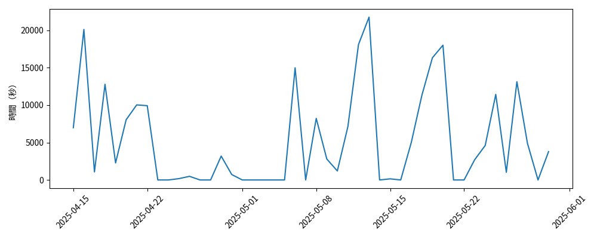
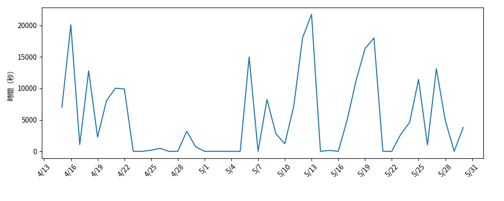
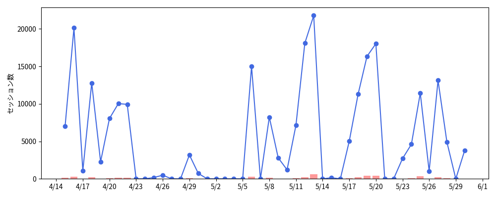
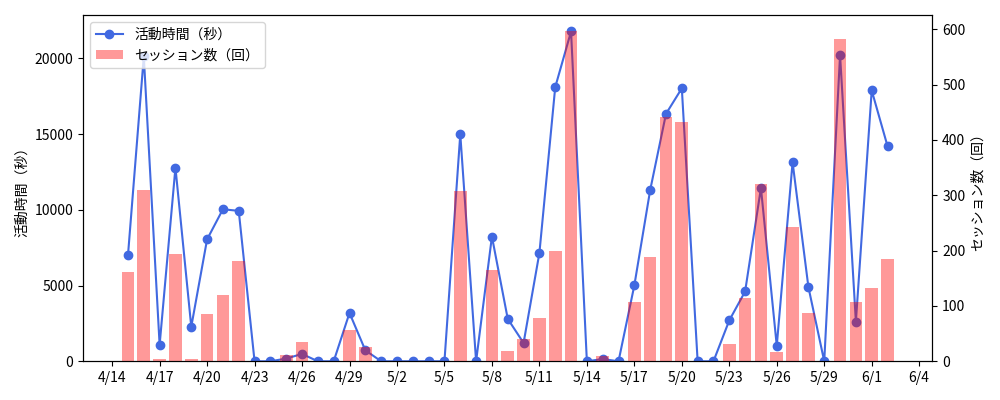
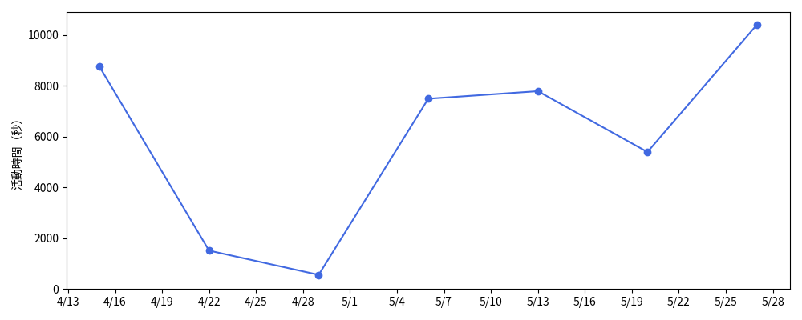

第 7 回では、時系列データの分析方法について学びます。

時系列データは、時間の経過に沿って収集されたデータです。株価分析や、気象データの予測、販売データの解析、トレンド予測など、さまざまな分野で活用されています。

## 7.1 時系列データの基本

### 7.1.1 時系列データの定義

時系列データとは、各データポイントが時間に対応しているデータのことであり、主に以下の特徴を持ちます。

- データが時間軸に沿って配置されている。
- データが連続的または離散的（定期的）に収集されている。
- 過去のデータが未来のデータに影響を与えることがある。

### 7.1.2 時系列データ分析の目的

時系列データは多くの分野で使用されており、その主要な分析目的としては以下のようなものがあります。

- 過去のパターンの理解
- 将来の値の予測
- 異常値の検出
- トレンドや周期性の把握

## 7.2 pandas による時系列データの基本

時系列データ処理には、主に `pandas` と `numpy` ライブラリを使用します。

### 7.2.1 時系列データの生成

日付範囲のデータ (`datetime`) を生成するには、[`pandas.date_range()`](https://pandas.pydata.org/docs/reference/api/pandas.date_range.html) 関数を使用し、引数で開始日 (`start`) やデータ数 (`periods`)、頻度 (`freq`) などを指定します。

```python
import pandas as pd
import numpy as np

# データ数
n = 7

# 日付範囲の生成
date_range = pd.date_range(start='2025-06-03', periods=n, freq='D')

# 時系列データの生成
data = np.random.randn(n)  # ランダムなデータ生成
ts = pd.Series(data, index=date_range)

# 時系列データの表示
print(ts)
```

```title="Output"
2025-06-03   -0.957430
2025-06-04   -0.519095
2025-06-05    0.429354
2025-06-06   -0.982983
2025-06-07   -0.704216
2025-06-08    0.185925
2025-06-09   -1.301902
Freq: D, dtype: float64
```

#### 頻度パラメータについて

[`pandas.date_range()`](https://pandas.pydata.org/docs/reference/api/pandas.date_range.html) 関数の頻度 (`freq`) は、デフォルトで `D` (1 日毎) が指定されていますが、以下のようにさまざま変更することができます。

```python
# 毎週金曜日（W-FRI）
pd.date_range(start='2025-06-03', periods=4, freq='W-FRI')

# 3日ごと
pd.date_range(start='2025-06-03', periods=10, freq='3D')

# 2時間おき
pd.date_range(start='2025-06-03', periods=12, freq='2h')
```

その他の頻度パラメータの詳細については、[こちら (Offset aliases)](https://pandas.pydata.org/docs/user_guide/timeseries.html#timeseries-offset-aliases) を確認するようにしてください。

### 7.2.2 CSV ファイルから時系列データの作成

CSV ファイルから時系列データを作成する方法を見ていきましょう。以下のような時系列情報を含む CSV ファイルがあるとします。

```csv title="活動ログデータ (log_0000001.csv)"
date,time[s],sessions
2025-04-15,6987,162
2025-04-16,20116,310
2025-04-17,1078,5
2025-04-18,12787,194
2025-04-19,2276,5
...
```

これを DataFrame として読み込むには、以前にも紹介したように、`pandas.read_csv()` 関数を用います。しかし、そのままでは先頭の日付の列 (`date`) が文字列として認識されてしまい、時系列データとして扱うことができません。このような場合、以下のような手順で時系列データに変換します。

1. `pandas.to_datetime()` 関数で日付の列を `datetime` 型に変換
2. `DataFrame.set_index()` 関数で日付の列を DataFrame のインデックスに設定

実際のコード例は以下のようになります。

```python
import pandas as pd

# CSV ファイルの読み込み
df = pd.read_csv("log_0000001.csv")

# 時系列データに変換
df["date"] = pd.to_datetime(df["date"])

# インデックスを date に設定
df = df.set_index("date")

# 先頭行の表示
print(df.head())
```

```title="Output"
            time[s]  sessions
date
2025-04-15     6987       162
2025-04-16    20116       310
2025-04-17     1078         5
2025-04-18    12787       194
2025-04-19     2276         5
```

#### CSV の読込と同時に時系列データ作成

はじめから CSV のどの列が日時を表すかわかっている場合は、`pandas.read_csv()` 関数の引数で `parse_dates=["列名"]` を指定することで、特定の列を自動的に `datetime` 型に変換したうえで読み込みます。以下は、`date` 列を `datetime` 型として読み込む例です。

```python title="CSV 読込時に時系列データ作成"
df = pd.read_csv("log_0000001.csv", parse_dates=["date"])
```

さらに、インデックスを `date` 列にしたい場合は、以下のように `index_col` を指定します。

```python title="CSV 読込時に時系列データ作成 & インデックス設定"
df = pd.read_csv("log_0000001.csv", parse_dates=["date"], index_col="date")
```

!!! note

    データが日付順になっていない場合は、`DataFrame.sort_index()` 関数で並び替えることができます。このとき、引数で `ascending=False` を指定すると、降順に並び替えることができます。

## 7.2.3 データの選択とスライシング

通常の DataFrame と同様に、`pandas.loc` インデクサを用いることで、時系列データから特定の日時の選択や、スライシングを行うことができます。

```python
# 特定の日付を選択
print(df.loc["2025-04-15"])

# 特定の日付範囲を抽出（スライシング）
print(df.loc["2025-04-15":"2025-04-22"])
```

```title="Output"
time[s]     6987
sessions     162
Name: 2025-04-15 00:00:00, dtype: int64
            time[s]  sessions

date
2025-04-15     6987       162
2025-04-16    20116       310
2025-04-17     1078         5
2025-04-18    12787       194
2025-04-19     2276         5
2025-04-20     8045        85
2025-04-21    10033       119
2025-04-22     9928       182
```

## 7.3 日付と時間のデータ型と変換

時系列データを正しく扱うために、日付と時間を適切に扱うための方法を学びましょう。

### 7.3.1 日付と時間のデータ型

Python で日付と時間の効率的に取り扱うためには、`datetime` モジュールを使います。このモジュールに含まれる `datetime` クラスは、日付と時間の両方を扱うことができます。

`datetime` モジュールから `datetime` クラスをインポートするには、以下のようにします。

```python
from datetime import datetime
```

`datetime.now()` 関数を用いると、現在の日時を取得することができます。

```python title="現在日時の取得"
from datetime import datetime

now = datetime.now()
print("現在の日時: ", now)
```

```title="Output"
現在の日時:  2025-05-30 05:14:52.577857
```

`datetime` クラスの他にも、日付のみを扱う `date` クラスや、時間のみを扱う `time` クラスも用意されています。

### 7.3.2 文字列から `datetime` への変換

文字列を `datetime` 型（`datetime` クラスのオブジェクト）に変換するには、`strptime()` 関数を用います。

```python title="文字列から datetime への変換"
from datetime import datetime

date_string = "2025-05-30 14:30:00"
dt = datetime.strptime(date_string, "%Y-%m-%d %H:%M:%S")
print("変換された日時: ", dt)
```

```title="Output"
変換された日時:  2025-05-30 14:30:00
```

ただし、`pandas` を使用している場合、基本的には `pandas.to_datetime()` 関数を使用したほうが柔軟性が高く便利です。

### 7.3.3 `datetime` から文字列への変換

`datetime` 型のオブジェクトを文字列に変換するには、`strftime()` 関数を用います。このとき、引数で書式コードを指定することで、変換後の日時表記のスタイルを調整することができます。

```python title="datetime から文字列への変換"
from datetime import datetime

# 現在日時の取得
now = datetime.now()

# datetime を文字列に変換
formatted_date = now.strftime("%Y年%m月%d日 %H時%M分%S秒")

print("フォーマット前の日時:" , now)
print("フォーマット後の日時:" , formatted_date)
```

```title="Output"
フォーマット前の日時: 2025-05-30 05:39:52.731397
フォーマット後の日時: 2025年05月30日 05時39分52秒
```

書式の詳細は、Python 公式ドキュメントの「[strftime() と strptime() の書式コード](https://docs.python.org/ja/3/library/datetime.html#strftime-and-strptime-format-codes)」を参照するようにしてください。

### 7.3.4 タイムゾーンの取り扱い

`datetime` 型のオブジェクトは、デフォルトではタイムゾーンの情報を含みません (naive datetime)。

`datetime` モジュールで任意のタイムゾーンを設定するには、`zoneinfo` モジュールを用います。例えば、タイムゾーンを JST (日本時間, UTC+0900) にするには、以下のようにします。

```python
from datetime import datetime
from zoneinfo import ZoneInfo

# 現在日時の取得（タイムゾーン: JST）
now = datetime.now(ZoneInfo("Asia/Tokyo"))
print(now)
```

```title="Output"
2025-05-30 14:49:41.189614+09:00
```

pandas でタイムゾーンを設定するには、[`DataFrame.tz_localize()`](https://pandas.pydata.org/docs/reference/api/pandas.DataFrame.tz_localize.html) 関数を用います。タイムゾーンを JST にするには、引数で `"Asia/Tokyo"` を指定します。以下は、日時の文字列を `datetime` に変換し、インデックスに設定したうえで、タイムゾーンを JST にするコードの例です。

```python title
import pandas as pd

# CSV の読み込み & 時系列データに変換 (index = naive timezone)
df = pd.read_csv("log_0000001.csv", parse_dates=["date"], index_col="date")

# タイムゾーンを JST に設定
df.index = df.index.tz_localize("Asia/Tokyo")
print(df.index[0])
```

```title="Output"
2025-04-15 00:00:00+09:00
```

また、既に設定されているタイムゾーンを別のタイムゾーンに変換するには、[`DataFrame.tz_convert()`](https://pandas.pydata.org/docs/reference/api/pandas.Series.dt.tz_convert.html) 関数を用います。

## 7.4 時系列データの可視化

時系列データを可視化する方法を見ていきましょう。

### 7.4.1 Matplotlib による時系列データ可視化

時系列データはこれまで学んできた方法と同様、Matplotlib や Seaborn で可視化することができます。Matplotlib による基本的な折れ線グラフを描くには、以下のように `pyplot.plot()` 関数を用います。

```python
import pandas as pd
import matplotlib.pyplot as plt

# CSV の読み込み & 時系列データに変換
df = pd.read_csv("log_0000001.csv", parse_dates=["date"], index_col="date")

# 折れ線グラフで可視化
fig, ax = plt.subplots(figsize=(10, 4))
ax.plot(df["time[s]"])
ax.set_ylabel("時間（秒）")
plt.xticks(rotation=45)
plt.tight_layout()
plt.show()
```

{: .wide-image }

### 7.4.2 Matplotlib による時系列データの軸調整

前項では `pyplot.plot()` 関数による時系列データの可視化を行いましたが、日付軸のフォーマットや、軸の間隔を調整することで、より見やすいグラフにすることができます。

日付軸のフォーマット設定には、`matplotlib.dates` モジュールに含まれる `dates.DateFormatter` や `dates.DayLocator` が役に立ちます。例えば、`ax` という名前の `Axes` オブジェクトがあるとき、これらは以下のようにして使うことができます。

```python
import matplotlib.dates as mdates

# x軸の日付を「2025/04/13」→「4/13」のようにフォーマット
ax.xaxis.set_major_formatter(mdates.DateFormatter("%-m/%-d"))

# x軸の日付の間隔を3日毎に設定
ax.xaxis.set_major_locator(mdates.DayLocator(interval=3))
```

{: .wide-image }

日付の軸ラベルが「4/13」のようにシンプルになり、3 日毎に配置されるようになりました。

プログラムは少しややこしく感じられるかもしれませんが、はじめのうちはこういうものであると思い、フォーマット指定部分や数字の部分のみを変更するくらいでも問題ありません。以下は、上記コードのフォーマット設定を構成する要素の概説です。

<!-- - `pyplot.gca()`: 現在の軸 (`Axes`) を取得します (get current axes)。 -->

- `axes.xaxis`: `Axes` オブジェクトの中にある x 軸に関するプロパティです。
- `axis.set_major_formatter()`: 主ラベル (major ticks) のフォーマットを指定します。
- `axis.set_major_locator()`: 主ラベル (major ticks) を置く位置を指定します。
- `dates.DateFormatter()`: 日付フォーマットのオブジェクトです。
- `dates.DayLocator()`: 日付の配置に関するオブジェクトです。

### 7.4.3 複合グラフの描画

Matplotlib を使用して、複合グラフを描いてみましょう。複合グラフとは、複数の異なる種類のグラフを組み合わせて描画するグラフのことで、例えば「折れ線グラフ」と「棒グラフ」を組み合わせたものなどです。

試しに、これまでの方法を組み合わせて折れ線グラフを棒グラフを同時に描いてみましょう。以下のコード例では、折れ線グラフに `time[s]`（活動時間（秒））を、棒グラフに `sessions`（セッション数）を指定しています。

```python
import pandas as pd
import matplotlib.pyplot as plt
import matplotlib.dates as mdates

# CSV読み込み & 日付をインデックスに
df = pd.read_csv("log_0000001.csv", parse_dates=["date"], index_col="date")

# 図と左y軸を作成
fig, ax = plt.subplots(figsize=(10, 4))

# 折れ線グラフ: time[s]
ax.plot(
    df.index,
    df["time[s]"],
    color="royalblue",
    marker="o",
    label="time [s]"
)
ax.set_ylabel("活動時間（秒）")

# 折れ線グラフ: sessions
ax.bar(
    df.index,
    df["sessions"],
    color="red",
    alpha=0.4,
    label="sessions"
)
ax.set_ylabel("セッション数")

# x軸フォーマットと間隔
ax.xaxis.set_major_formatter(mdates.DateFormatter("%-m/%-d"))
ax.xaxis.set_major_locator(mdates.DayLocator(interval=3))

# レイアウト調整・表示
fig.tight_layout()
plt.show()
```

{: .wide-image }

折れ線グラフと棒グラフを同時に表示することができました。しかし、2 つのグラフの軸が共有されているため、数値のスケールが合っておらず、セッション数の棒グラフの様子が見えにくくなってしまっています。このようなときは、グラフの左側と右側で、それぞれ異なるスケールの軸を設定することが望ましいです。

x 軸を共有して、y 軸を別に作成するためには、`axes.twinx()` 関数を用います。そうすることで、以下のように、スケールが異なっていても視覚的にわかりやすい複合グラフを作成することができます。

```python
import pandas as pd
import matplotlib.pyplot as plt
import matplotlib.dates as mdates

# CSV読み込み & 日付をインデックスに
df = pd.read_csv("log_0000001.csv", parse_dates=["date"], index_col="date")

# 図と左y軸を作成
fig, ax1 = plt.subplots(figsize=(10, 4))

# 折れ線グラフ: time[s]
line = ax1.plot(
    df.index,
    df["time[s]"],
    color="royalblue",
    marker="o",
    label="time [s]"
)
ax1.set_ylabel("活動時間（描画）")
ax1.set_ylim(0)

# 右y軸を作成
ax2 = ax1.twinx()

# 折れ線グラフ: sessions
bar = ax2.bar(
    df.index,
    df["sessions"],
    color="red",
    alpha=0.4,
    label="sessions"
)
ax2.set_ylabel("セッション数")

# x軸フォーマットと間隔
ax1.xaxis.set_major_formatter(mdates.DateFormatter("%-m/%-d"))
ax1.xaxis.set_major_locator(mdates.DayLocator(interval=3))

# 凡例をまとめて表示（折れ線とバー両方）
ax1.legend([line[0], bar], ["活動時間 [s]", "セッション数"])

# レイアウト調整・表示
fig.tight_layout()
plt.show()
```

{: .wide-image }

!!! note "複数の凡例をまとめて表示"

    ここでは折れ線グラフを `line`、棒グラフを `bar` という変数に格納しており、`axes.legend()` 関数にラベル情報を併せてリストで渡すことで、複数の凡例をまとめて表示させています。なお、`pyplot.plot()` 関数はリストを返すため、`line` には `[0]` をつけて先頭のデータを渡しています。

## 7.5 時系列データの前処理

本章の最後に、時系列データに対する重要な前処理のテクニックを幾つか見ていきましょう。

### 7.5.1 リサンプリング

リサンプリングとは、時系列データの頻度（間隔）を変換する操作のことです。高頻度のデータを低頻度に変換することを **ダウンサンプリング**、低頻度のデータを高頻度に変換することを **アップサンプリング** と呼びます。

#### ダウンサンプリング

ダウンサンプリングでは、一般的にデータを集約することで、頻度を減らします。例えば、1 日単位のデータを 1 週間単位に変換する場合、`DataFrame.resample()` 関数を用いて以下のように書きます。

```python
import pandas as pd
import matplotlib.pyplot as plt
import matplotlib.dates as mdates

# CSV読み込み & 日付をインデックスに
df = pd.read_csv("log_0000001.csv", parse_dates=["date"], index_col="date")

# 一週間単位のデータを集約（平均化）
resampled = df.resample("7D").mean()

# 図と左y軸を作成
fig, ax = plt.subplots(figsize=(10, 4))

# 折れ線グラフ: time[s]
ax.plot(
    resampled.index,
    resampled["time[s]"],
    color="royalblue",
    marker="o",
    label="time [s]"
)
ax.set_ylabel("活動時間（描画）")
ax.set_ylim(0)

# x軸フォーマットと間隔
ax.xaxis.set_major_formatter(mdates.DateFormatter("%-m/%-d"))
ax.xaxis.set_major_locator(mdates.DayLocator(interval=3))

# レイアウト調整・表示
fig.tight_layout()
plt.show()
```

{: .wide-image }

時系列データの大局的な変動を表すグラフになりました。ダウンサンプリングの集約処理としては、主に以下の関数が用いられます。

- `mean()`: 平均値を計算
- `sum()`: 合計値を計算
- `min()`: 最小値を計算
- `max()`: 最大値を計算

#### アップサンプリング

アップサンプリングでは、新たにデータポイントを補完して、データの頻度を増やします。`DataFrame.resample("[freq]").asfreq()` とすることで、指定した頻度 (`freq`) のデータポイントが追加され、`NaN` で補完されます。同時に欠損値処理を行う場合は、続けて `fillna()` 関数などを使用します。

!!! note "その他の時系列データ分析"

    本講義では取り扱いませんが、時系列データを分析するうえで重要なキーワードとして、「移動平均」「トレンド抽出」「季節性抽出」「自己回帰」「ラグプロット」などがあります。高度な分析に興味のある人は、これらのキーワードを参考に調べてみてください。

## 演習

!!! tip "演習 7-1"

    TBA

!!! tip "演習 7-2"

    TBA

## 授業アンケート

TBA

<!-- <div style="text-align: center;">
<a href="https://forms.office.com/r/CiHP5t6BGE">

</a>
<br>
<a href="https://forms.office.com/r/GpWK0XfShP">https://forms.office.com/r/GpWK0XfShP</a><br>
（回答期限：2025 年 6 月 6 日 23:59）
</div> -->
