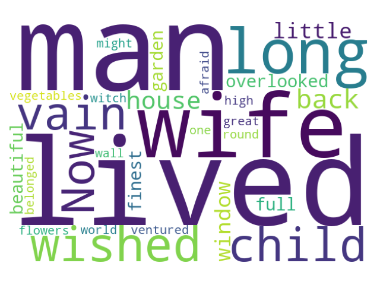

第 8 回では、テキストデータ処理の基本について学びます。

## 8.1 テキストデータ処理とは

テキストデータ処理は、情報をテキスト形式で保存、編集、分析するための手法であり、多くの分野で頻繁に利用されています。テキストデータ処理には、以下のような操作が含まれます。

- **テキストの基本操作**: 文字列の結合や分割、抽出など
- **テキストのクリーニング**: 不要なデータやノイズ除去、欠損データ補完など
- **テキストの変換**: 文字コードの変換や正規化
- **テキストの分析**: テキスト内容の理解やパターン・傾向の抽出

## 8.2 基本的な文字列操作

Python には、文字列を操作するための便利な関数やメソッドがさまざま用意されています。以下ではその代表例を紹介します。

### 8.2.1 文字列の結合

文字列の結合を行うには、`join` メソッドを用います。`[区切り文字].join([文字列のリスト])` のようにすることで、文字列のリスト（または他のイテラブル）を区切り文字で連結し、一つの文字列にすることができます。

```python
words = ["Python", "は", "強力です"]
print("".join(words))
print(" ".join(words))
```

```title="Output"
Pythonは強力です
Python は 強力です
```

### 8.2.2 文字列の分割

文字列を分割したい場合は、`split` メソッドを用います。`[文字列].split([区切り文字])` のようにすることで、文字列を指定した区切り文字で分割し、リストにすることができます。区切り文字を省略した場合は、スペースで分割されます。

```python
text = "Python is simple, powerful, and widely used."
print(text.split(","))
print(text.split())
```

```title="Output"
['Python is simple', ' powerful', ' and widely used.']
['Python', 'is', 'simple,', 'powerful,', 'and', 'widely', 'used.']
```

### 8.2.3 文字列の置換

特定の文字列を別の文字列に置換したり、除去したりしたい場合は、`replace` メソッドを用います。`[文字列].replace([置換前の文字列], [置換後の文字列])` のようにすることで、文字列の置換を行うことができます。

```python
text = "Pythonは楽しいです。"
print(text.replace("Python", "プログラミング"))
```

```title="Output"
プログラミングは楽しいです。
```

!!! note "`replace` による文字列の除去"

    置換後の文字列を空文字列 (`""`) にすることで、指定した文字列を取り除くことができます。

### 8.2.4 テキストデータの読み込み

テキストファイル (`.txt`) を開いてデータを読み込むには、`with open` と `read()` メソッドを用います。例えば、`Rapunzel.txt` というファイルを読み込んで `text` という変数に格納するには、以下のようにします。

```python
with open("Rapunzel.txt", "r") as f:
    text = f.read()
print(text[:100])
```

```title="Output"
There once lived a man and his wife, who had long wished for a child, but in vain. Now there was at
```

ここで `"r"` は、ファイルを「読み取り専用」モード (read mode) で開こうとしていることを意味します。その他にも「書き込み」「追記」「新規作成」などいくつかのモードが存在しますが、本講義では扱いませんので、興味のある方は各自で調べるようにしてください。

!!! warning "CHIKUWA Editor におけるファイルの書き込みについて"

    CHIKUWA Editor では、セキュリティの都合上、Python プログラムからファイルの作成や書き込みを行うことができないようになっています。

## 8.3 形態素解析

形態素解析とは、文を意味を持つ最小単位の単語（形態素）に分割する操作のことです。日本語の文章に対して自然言語処理を適用する場合、文章を単語単位に分割する分かち書き（形態素解析）が必要になります。形態素解析器には、MeCab や Juman++、Janome などがよく使用されます。

例えば、「吾輩は猫である」という文は、「吾輩」「は」「猫」「で」「ある」に分割されます。

### 8.3.1 MeCab と辞書データのインストール

形態素解析を実際に実行するには、形態素解析器と辞書データをインストールする必要があります。例えば、Google Colaboratory などで以下のコマンドを実行することで、高性能な形態素解析器である MeCab と、軽量の辞書データ unidic-lite をインストールすることができます。

```
!pip install mecab-python3 unidic-lite
```

インストール後、以下のようにインポートすることで、MeCab を使えるようになります。

```python
import MeCab
```

!!! note "CHIKUWA Editor における形態素解析器と辞書データについて"

    CHIKUWA Editor には、形態素解析器として「MeCab」が、日本語辞書として「mecab-ipadic-utf8」が標準でインストールされており、これらを用いて形態素解析の練習ができるようになっています。

### 8.3.2 MeCab による形態素解析の基礎

MeCab を用いた形態素解析の基本的な流れを見ていきましょう。

まずは、MeCab の解析器（Tagger）のインスタンスを作成します。日本語の文章を解析してくれる、実際の道具を準備する（工具箱から工具を取り出す）イメージです。

```python
tagger = MeCab.Tagger()
```

そして、`Tagger` のインスタンスから `parse()` メソッドを呼び出すことで、形態素解析が実行されます。

```python
result = tagger.parse("テキスト")
```

例えば、「すもももももももものうち」という文を MeCab で形態素解析する一連の流れは以下のようになります。

```python title="MeCab による形態素解析"
import MeCab

# MeCab のインスタンス生成
tagger = MeCab.Tagger()

# 解析するテキスト
text = "すもももももももものうち"

# 形態素解析を実行し、結果を表示
result = tagger.parse(text)
print(result)
```

```title="Output"
すもも	名詞,一般,*,*,*,*,すもも,スモモ,スモモ
も	助詞,係助詞,*,*,*,*,も,モ,モ
もも	名詞,一般,*,*,*,*,もも,モモ,モモ
も	助詞,係助詞,*,*,*,*,も,モ,モ
もも	名詞,一般,*,*,*,*,もも,モモ,モモ
の	助詞,連体化,*,*,*,*,の,ノ,ノ
うち	名詞,非自立,副詞可能,*,*,*,うち,ウチ,ウチ
EOS
```

### 8.3.3 形態素解析のオプション

（準備中）

### 8.3.4 特定の品詞の抽出

形態素解析ができたら、特定の品詞を抽出してみましょう。文書の解析でよく利用される重要な品詞は、「名詞」「形容詞」「動詞」です。

まずは、`parseToNode()` メソッドを用いて、形態素解析の結果をノードに変換します。ノードとは、数珠つなぎの要素のようなイメージで、`next` や `prev` によって隣り合うノードを順番に見て回ることができる仕組みを指します。

```python
node = tagger.parseToNode(text)
```

次に、while 文を使用し、ノード化された形態素解析の結果を一つ一つ参照していきます。このとき、ノードの `surface` 属性には単語が、`feature` 属性には品詞の情報が入っています。形態素解析をした後、単語のリストと品詞のリストを作成するプログラムは以下のようになります。

```python title="単語と品詞のリストを作成"
import MeCab

# MeCab のインスタンス生成
tagger = MeCab.Tagger()

# 解析するテキスト
text = "すもももももももものうち"

# 形態素解析を実行し、ノードに変換
node = tagger.parseToNode(text)

# 単語と品詞を格納するためのリスト
words = []
types = []

# ノードがなくなるまで解析結果を表示
while node:
  if node.surface: # surface 属性（単語）が存在する場合
    words.append(node.surface)
    types.append(node.feature.split(",")[0])
  node = node.next # 次のノードに移動

print("単語:", words)
print("品詞:", types)
```

```title="Output"
単語: ['すもも', 'も', 'もも', 'も', 'もも', 'の', 'うち']
品詞: ['名詞', '助詞', '名詞', '助詞', '名詞', '助詞', '名詞']
```

`node.feature` の中には、`"名詞,一般,*,*,*,*,すもも,スモモ,スモモ"` のように、複数の情報がまとめて入っています。ここから `"名詞"` という情報だけ抽出したい場合には、上のコードで示しているように、`split` メソッドでテキストをカンマで区切り、生成されたリストの先頭を参照すれば良いというわけです。

品詞が「名詞」の単語のみを抽出してリスト化するには、以下のようにループの中で `if` 文を使用します。

```python title="名詞のみ抽出"
import MeCab

# MeCab のインスタンス生成
tagger = MeCab.Tagger()

# 解析するテキスト
text = "すもももももももものうち"

# 形態素解析を実行し、ノードに変換
node = tagger.parseToNode(text)

# 単語を格納するためのリスト
nouns = []

# ノードがなくなるまで解析結果を表示
while node:
  pos = node.feature.split(",")[0] # 品詞を取得
  if pos == "名詞": # 品詞が「名詞」であった場合
    nouns.append(node.surface) #リストに追加
  node = node.next # 次のノードに移動

print("名詞:", nouns)
```

```title="Output"
名詞: ['すもも', 'もも', 'もも', 'うち']
```

<br>
# 8.4 WordCloud

形態素解析ができるようになったら、[WordCloud](https://amueller.github.io/word_cloud/) を使用して文章の可視化をしてみましょう。WordCloud では、文章の中で出現頻度の高い単語を大きく、あまり出ない単語を小さく表示します。

### 8.4.1 WordCloud のインポート

WordCloud を使用するには、`wordcloud` ライブラリの中から、`WordCloud` クラスをインポートします。

```python
from wordcloud import WordCloud
```

### 8.4.2 WordCloud の生成

WordCloud を生成するには、`WordCloud` クラスの `generate()` メソッドに対し、スペースで区切られたテキストを渡します。また、`WordCloud` のインスタンスを生成する際は、`width`（画像の幅）や `height`（画像の高さ）、`background_color`（背景色）、`random_state`（乱数のシード値）などを指定することができます（詳細は[こちら](https://amueller.github.io/word_cloud/generated/wordcloud.WordCloud.html)）。

以下は、英語のテキストに対して WordCloud を生成する基本的なコードの例です。

```python
from wordcloud import WordCloud
import matplotlib.pyplot as plt

# テキスト（「Rapunzel」の冒頭）
text = "There once lived a man and his wife, who had long wished for a child, but in vain. Now there was at the back of their house a little window which overlooked a beautiful garden full of the finest vegetables and flowers; but there was a high wall all round it, and no one ventured into it, for it belonged to a witch of great might, and of whom all the world was afraid."

# WordCloud の生成
wordcloud = WordCloud(
    width=600,
    height=400,
    background_color="white",
    random_state=42
).generate(text)

# WordCloud の表示
plt.imshow(wordcloud)
plt.axis("off")
plt.tight_layout()
plt.show()
```

!!! note "乱数のシード値 (`randam_state`) について"

    WordCloud ではデフォルトでランダムに単語の配置を行うため、実行するたびに結果が変わってしまいます。これを防ぎ、結果の再現性を担保するためには、上記コードのように乱数のシード値 (`randam_state`) を設定します。



### 8.4.3 日本語文章の WordCloud

英語の場合は元から単語がスペースで区切られているため、そのまま WordCloud を生成することができましたが、日本語の場合はそうはいきません。まずは形態素解析を行い、単語をスペースで区切った形に変換する必要があります。以下は、MeCab を用いて形態素解析（分かち書き）を行い、日本語の WordCloud を生成するコードの例です。

CHIKUWA Editor を使用している場合、日本語のフォントパスは以下のように `/usr/share/fonts/truetype/noto/NotoSansCJK-Regular.ttc` を指定するようにしてください。

```python
import MeCab
from wordcloud import WordCloud
import matplotlib.pyplot as plt

# MeCab のインスタンス生成（分かち書き）
tagger = MeCab.Tagger("-Owakati")

# 解析するテキスト（「吾輩は猫である」の冒頭）
text = "吾輩わがはいは猫である。名前はまだ無い。どこで生れたかとんと見当けんとうがつかぬ。何でも薄暗いじめじめした所でニャーニャー泣いていた事だけは記憶している。吾輩はここで始めて人間というものを見た。"

# 形態素解析を実行
words = tagger.parse(text)

# 日本語フォントのパス
font_path = "/usr/share/fonts/truetype/noto/NotoSansCJK-Regular.ttc"

# WordCloud の生成
wordcloud = WordCloud(
    font_path=font_path,
    width=600,
    height=400,
    background_color="white",
    random_state=42
).generate(words)

# WordCloud の表示
plt.imshow(wordcloud)
plt.axis("off")
plt.tight_layout()
plt.show()
```


日本語の WordCloud を作成することができました。しかし、「は」や「で」など、それ自体は意味を持たない「助詞」が図の大半を占めており、有意義な WordCloud になっているとはいえません。より有意義な WordCloud にするためにはどのようにすればよいか、考えてみましょう。

## 演習

!!! tip "演習 8-1"

    TBA

!!! tip "演習 8-2"

    TBA

## 授業アンケート

TBA

<!-- <div style="text-align: center;">
<a href="https://forms.office.com/r/CiHP5t6BGE">

</a>
<br>
<a href="https://forms.office.com/r/GpWK0XfShP">https://forms.office.com/r/GpWK0XfShP</a><br>
（回答期限：2025 年 5 月 30 日 23:59）
</div> -->
